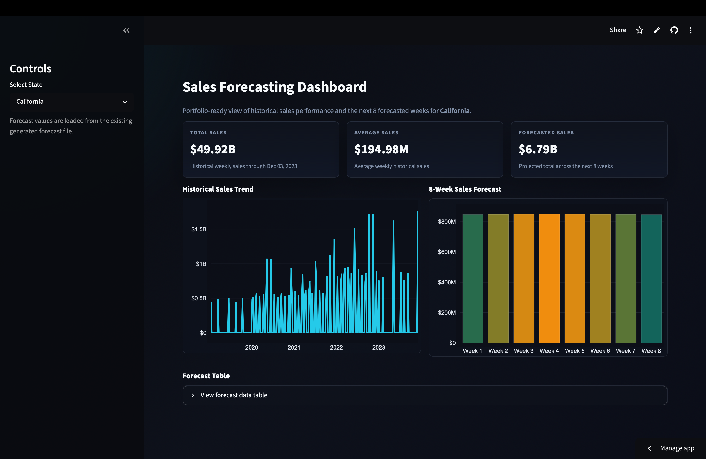
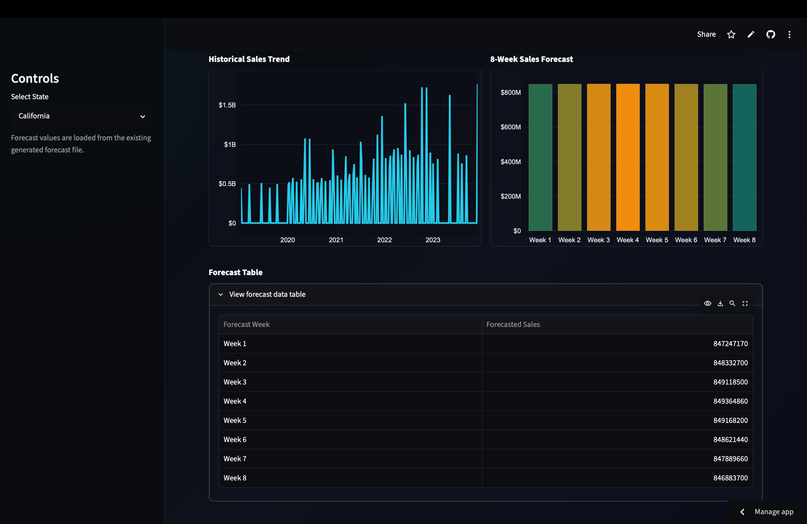

# Sales Forecasting System

An end-to-end machine learning project that forecasts future sales using historical data and presents insights through an interactive Streamlit dashboard. The system evaluates multiple forecasting models, compares their performance, selects the best-performing approach, and provides state-level sales analysis with 8-week sales predictions.

## Models Evaluated

- SARIMA
- Prophet
- XGBoost
- LSTM
  
## Features

- Interactive Streamlit dashboard
- State-wise sales analysis
- Historical sales trend visualization
- 8-week sales forecasting
- KPI cards for key business metrics
- FastAPI integration for forecast retrieval
- Interactive Plotly charts

## Tech Stack

- Python
- Streamlit
- Pandas
- Plotly
- FastAPI
- LSTM
- SARIMA
- Prophet
- XGBoost

## Project Structure

```text
Sales_Forecasting/ 
├── app.py 
├── api/
├── assets/ 
├── data/ 
├── models/ 
├── notebooks/ 
├── src/ 
├── requirements.txt 
└── README.md 
```

## Run Locally

```bash
pip install -r requirements.txt
streamlit run app.py
```

Open:

```text
http://localhost:8501 
```

## Dashboard Preview

### Dashboard Overview



### Forecast Table



## Dashboard

The dashboard provides:

- State selection dropdown
- Historical sales analysis
- 8-week forecast visualization
- KPI metrics dashboard
- Interactive data exploration

## Live Demo

[Open Dashboard](https://sales-forecasting-system-mksachdev.streamlit.app)
